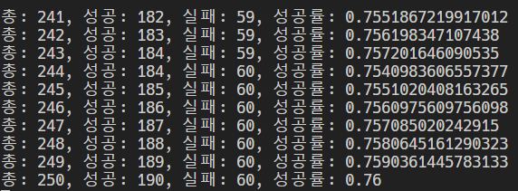

# 서울대학교 관심강좌 빈자리 자동 수강신청 스크립트

관심강좌 1페이지에 있는 강좌들 중 빈 강의가 있으면 자동 신청.
2020년 2월 기준으로 코드를 작성했기 때문에, 사이트 구조가 바뀌면 작동하지 않을 수도 있습니다.

- 동작 과정
  1. `TensorFlow` 이용해서 `MNIST` 데이터셋으로 트레이닝한 모델 저장
  2. `Selenium`, `BeautifulSoup4`를 이용해서 수강신청 사이트 크롤링
  3. `OpenCV` 이용해서 수강신청 확인문자 이미지 추출 후 전처리, 2자릿수 이미지를 2장의 1자릿수 이미지로 변환.
  4. 저장되어 있는 모델을 이용해서 변환된 2장의 이미지에서 숫자 인식
  5. 숫자 예측 결과를 이용해 수강 신청!

**NOTE: 기초적인 MNIST 모델을 사용하기 때문에 숫자 인식 성공률은 250회 실험 결과 약 76% 정도가 나왔습니다. (즉 빈 자리가 나도 수강신청을 실패할 수도 있음...)**



## 사용 방법

1. 레포 다운 후 필요한 프로그램 설치

    프로그램: **`Chrome`, `ChromeDriver`, `Python 3`**

    `ChromeDriver`는 `Chrome`과 버전 앞자리 수가 같아야 함 (예: Chrome 79.x <-> ChromeDriver 79.x). 현재 `static` 폴더 안에 있는 파일의 드라이버 버전은 [`개발 환경`](#개발-환경) 참조.

    `2020년 2월` 현재 `TensorFlow`는 `Python 3.7`까지만 지원하므로 `Python 3.8` 이상은 실행 불가.

2. Python 패키지 설치

    ```shell
    pip install --upgrade TensorFlow
    pip install bs4 selenium opencv-python
    ```

3. `sugang.py` 에서 전역 변수들 설정

    - `USER_ID`, `USER_PW`, `EXCLUDE_JUNIORS`, `REFRESH_INTERVAL_IN_SECONDS`, `WAIT_LIMIT_IN_SECONDS`, `LOOP_LIMIT`

4. `sugang.py` 실행

## 개발 환경

- 운영체제: `Windows 10 64bit 19H2`
- 브라우저: `Chrome 79.0.3945.130`
- 언어: [`Python 3.7.6`](https://www.python.org/downloads/release/python-376/)
- 기타: [`ChromeDriver 79.0.3945.36`](https://chromedriver.chromium.org/downloads), [`TensorFlow 2.0`](https://www.tensorflow.org/install)
- 시기: `2020년 2월`
